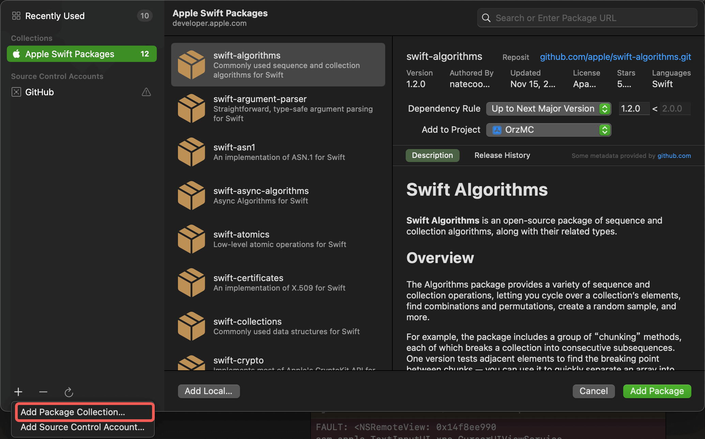

# OrzSPC

Swift Package Collection Used By OrzGeeker 

**Note:** `SPC` means `Swift Package Collection`

## Usage

- run command line as follow:

```
swift package-collection add --trust-unsigned \
    https://raw.githubusercontent.com/OrzGeeker/OrzSPC/main/OrzGeeker.json
```

- Or you can add the SPC url into Xcode manually:

- 

## TODO

- [X] Create the OrzGeeker SPC

- [ ] Sign the OrzGeeker SPC

- [ ] Distribute the OrzGeeker SPC


## Links

- [Swift Package Collection Blog](https://www.swift.org/blog/package-collections/)

- [Swift Package Collection Doc](https://github.com/apple/swift-package-manager/blob/main/Documentation/PackageCollections.md)
